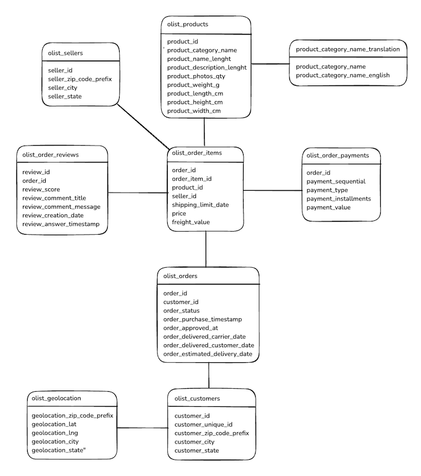

# Teste Técnico - Triggo.ai 

## Objetivo  
Analisar um conjunto de dados históricos de vendas pra obter insights para ajudar nas decisões de negócio.

## Tenologias Utilizadas  
* Python
* Pandas
* Matplotlib

## Tarefas

### 1. Preparação dos Dados (25 pontos)

- Importar os arquivos CSV do dataset
- Realizar a limpeza necessária (tratar valores nulos, remover duplicatas, etc.)
- Fazer a normalização de colunas quando necessário
- Criar um modelo relacional e conectar as tabelas adequadamente

- Descrever os passos de preparação dos dados adotados.
   * Mapeamento e uma visão geral das tabelas e relacionamentos entre elas
   * Criação de classes pra proporcionar escalabildade do código.
   * Aplicação do conceito de Staging Area pra trabalhar com os dados e não alterar os dados originais.

### 2. Análise Exploratória de Dados (25 pontos)

- Responda às seguintes perguntas utilizando SQL e Python:
   
   a) Qual o volume de pedidos por mês? Existe sazonalidade nas vendas?
   
   b) Qual a distribuição do tempo de entrega dos pedidos? 
   
   c) Qual a relação entre o valor do frete e a distância de entrega?
   
   d) Quais são as categorias de produtos mais vendidas em termos de faturamento?
   
   e) Quais estados brasileiros possuem o maior valor médio de pedido?

### 3. Solução de Problemas de Negócio (25 pontos)

Você deve resolver as seguintes questões de negócio:

1. **Análise de Retenção**: Calcule a taxa de clientes recorrentes. Considere um cliente recorrente aquele que fez mais de um pedido no período analisado. Quais insights podemos extrair destes dados?

2. **Predição de Atraso**: Crie um modelo simples para prever se um pedido será entregue com atraso. 
   - Defina o que seria um pedido atrasado (baseado nas colunas disponíveis)
   - Use os campos relevantes para criar features para seu modelo
   - Divida o dataset em treino e teste
   - Implemente um modelo de classificação simples (pode usar Regressão Logística, Random Forest ou outro de sua escolha)
   - Avalie a performance do modelo e explique os resultados

3. **Segmentação de Clientes**: Utilize técnicas de clustering para segmentar os clientes em grupos. Analise o comportamento de cada grupo e sugira estratégias de marketing específicas para cada um.

4. **Análise de Satisfação**: Explore a relação entre a nota de avaliação dos clientes e diferentes aspectos como categoria do produto, tempo de entrega, valor do pedido, etc. Identifique fatores que mais impactam na satisfação do cliente.

### 4. Visualização e Dashboards (25 pontos)

Crie visualizações e dashboards que respondam às seguintes necessidades:

1. Um dashboard geral que mostre a evolução das vendas ao longo do tempo, com filtros por estado e categoria de produto

2. Um mapa de calor mostrando a concentração de vendas por região/estado do Brasil

3. Um conjunto de gráficos que apresente a relação entre avaliação do cliente e tempo de entrega

4. Um dashboard de análise dos vendedores, mostrando quais têm melhor desempenho em termos de volume de vendas, satisfação do cliente e tempo de entrega
